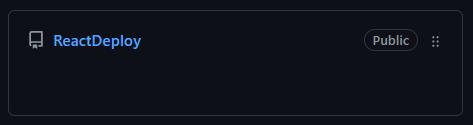
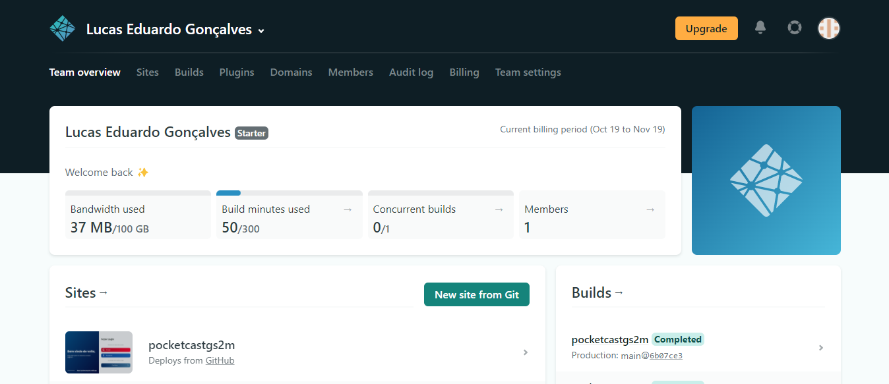
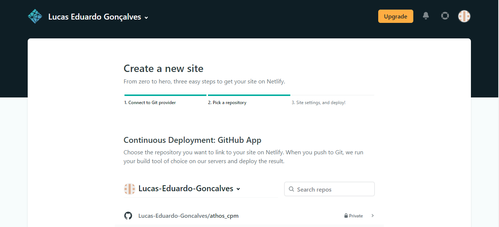
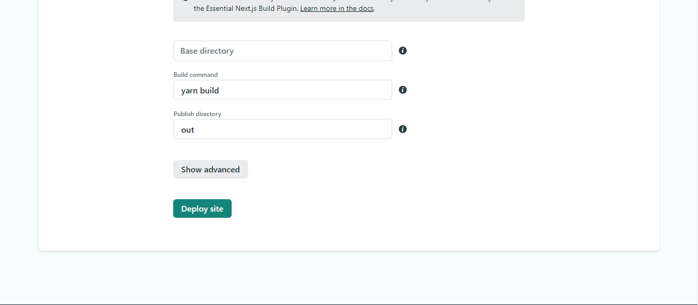

# Deploy com Netlify
 
 

Para postar um projeto no netlify:
 

## Pelo github
1 - Crie seu projeto com o comando `create-react-app` da maneira que preferir.
 
 

 

2 - Publique seu repositório no github.
 
 

 

3 - Vá ao site do <a href="https://www.netlify.com">Netlify</a> e faça seu login.

4 - Já dentro do site do Netlify, haverá um botão `new site from git`.
 
 

 

5 - Ao clicar no botão você chegará a seguinte tela: 
 
 

 

6 - Escolha a opção `github`, provavelmente será necessario fazer um login.

7 - Logo após será mostrado seus repositórios publicos e privados. Escolha um repositório.
 
 

 

8 - Só dar o seu deploy.
 
 

 
